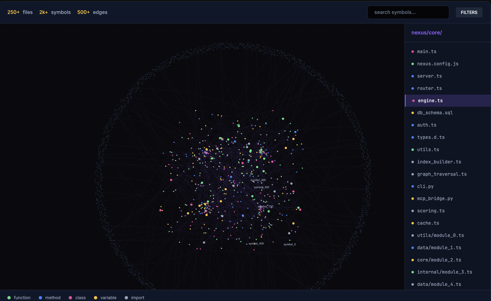

# Nexus Graph

### The Intelligence Map of your Codebase.

Nexus is a local-first retrieval engine that parses your codebase into a directed symbol graph. It serves high-precision, token-efficient context to AI assistants via the **Model Context Protocol (MCP)**.

[](https://www.npmjs.com/package/@costline/nexus-graph)
[](https://opensource.org/licenses/MIT)
[](https://www.npmjs.com/package/@costline/nexus-graph)

---

Nexus-Graph is optimized for immediate use with **Claude Code**, **Cursor**, and **Gemini**.

```bash
# 1. Install globally
npm install -g @costline/nexus-graph

# 2. Index your project
nexus-graph index --project .

# 3. Start the MCP Server
nexus-graph server --project .
```

---

## Screenshots

| Interactive Graph UI |
|---------------------|
|  |

---

## Features

- **Multi-language**: Python, TypeScript, JavaScript (JSX/TSX)
- **Symbol graph**: functions, classes, methods, variables, interfaces, type aliases — with import/call/extends edges
- **Token-budgeted context**: BFS from anchor symbols, scored by proximity + recency, degraded gracefully (full → definition-only) to stay within budget
- **Full-text search**: FTS5 over symbol names and signatures
- **File watcher**: incremental re-index on save (`--watch`)
- **Two transports**: stdio (Claude Code native) and HTTP (Streamable MCP)
- **Interactive visualization**: neon graph UI — directory overview, drill into file/symbol clusters

## Performance

Nexus Graph is designed for speed and efficiency, even on large codebases:

- **Fast indexing:** Indexes 1,000+ files in under 15 seconds on a typical laptop (M1 MacBook Air, Node.js 18)
- **Low-latency queries:** Most context queries return in under 100ms
- **Token savings:** Delivers 5–10x smaller context blocks compared to file-based retrieval, reducing LLM token usage and cost
- **Incremental updates:** File watcher re-indexes only changed files in real time

---

## Installation

```bash
npm install -g @costline/nexus-graph
```

Or run without installing:

```bash
npx nexus-graph --project /path/to/your/project
```

---

## Quick Start

**1. Index your project and start the MCP server (stdio)**

```bash
nexus-mcp --project /path/to/your/project
```

Nexus indexes all `.py`, `.ts`, `.tsx`, `.js`, `.jsx` files on first run, writes `<project>/.nexus/graph.db`, then listens on stdio.

**2. Add to Claude Code**

```jsonc
// ~/.claude/settings.json
{
  "mcpServers": {
    "nexus": {
      "command": "nexus-mcp",
      "args": ["--project", "/path/to/your/project"]
    }
  }
}
```

**3. Use in Claude Code**

Claude will automatically call `get_context_for_query` before answering questions about your codebase. You can also call it explicitly:

```
use get_context_for_query for "how does the auth middleware work?"
```

---

## CLI Reference

### `nexus-graph index`
Index all symbols and build the initial code graph.
```bash
nexus-graph index --project /path/to/project
```

### `nexus-graph server`
Start the MCP server (Stdio by default).
```bash
nexus-graph server --project /path/to/project --port 3000
```

### `nexus-graph viz`
Launch the interactive web-based graph visualizer.
```bash
nexus-graph viz --project /path/to/project
```

---

## MCP Tools

| Tool | Description |
|------|-------------|
| `get_context_for_query` | Natural-language query → BFS from matching symbols → ranked, token-budgeted context block |
| `search_symbols` | FTS5 search across symbol names and signatures |
| `get_symbol_context` | BFS from a named symbol, returns its context within token budget |
| `apply_edit_and_update_graph` | Re-index a single file after an edit (invalidates stale nodes) |
| `get_stats` | Returns symbol/edge/file counts for the current index |

### `get_context_for_query`

```typescript
get_context_for_query({
  query: string,          // natural-language description
  budget_tokens?: number, // token limit (default: 8000)
  k_steps?: number,       // BFS depth (default: 3)
})
```

Returns a text block with the most relevant function/class bodies and signatures, trimmed to fit the token budget.

### `search_symbols`

```typescript
search_symbols({
  query: string,   // full-text search (FTS5)
  limit?: number,  // max results (default: 20)
})
```

---

## Programmatic API

Nexus can also be used as a library:

```typescript
import { NexusDB } from 'nexus-graph/indexer/db';
import { indexProject } from 'nexus-graph/indexer/indexFile';
import { findAnchors, bfsTraversal } from 'nexus-graph/graph/traversal';
import { buildContext, formatContextResult } from 'nexus-graph/context/budget';
import { createSession, scoreNodes } from 'nexus-graph/graph/scorer';

const db = new NexusDB('/path/to/graph.db');

// Index a project
indexProject('/path/to/project', db);

// Query the graph
const session = createSession();
const anchors = findAnchors('authentication middleware', db, 5);
const nodes   = bfsTraversal(anchors, db, 3);
const scored  = scoreNodes(nodes, session);
const context = buildContext(scored, { maxTokens: 8000 });

console.log(formatContextResult(context));
```

---

1. **Anchor finding**: FTS5 full-phrase → word-by-word → file-path substring fallback
2. **BFS traversal**: `k`-step breadth-first from anchor symbols across import edges
3. **Budget manager**: greedy fill (full bodies) → definition-only → drop leaf nodes until within token budget

### Storage

```sql
-- Symbols table
CREATE TABLE symbols (
  id          TEXT PRIMARY KEY,  -- sha1(file:name:line)
  symbol_name TEXT,
  symbol_type TEXT,              -- function | class | method | variable | interface
  file_path   TEXT,
  start_line  INTEGER,
  end_line    INTEGER,
  signature   TEXT,
  docstring   TEXT,
  visibility  TEXT,
  body_hash   TEXT,
  last_edited INTEGER,
  edit_count  INTEGER
);

-- Directed edges
CREATE TABLE edges (
  from_id   TEXT,
  to_id     TEXT,
  edge_type TEXT,                -- imports | calls | extends | implements
  PRIMARY KEY (from_id, to_id, edge_type)
);

-- Full-text search
CREATE VIRTUAL TABLE symbols_fts USING fts5(
  symbol_name, file_path, signature,
  content=symbols, content_rowid=rowid
);
```

---

## Requirements

- Node.js ≥ 18
- The indexed project can be Python, TypeScript, or JavaScript (any mix)

---

## License

MIT
 
